# Visµm - Laser Scanning Control GUI

Laser scanning microscope control software GUI written in Pascal using LabView NIDAQ APIs and National Instruments cards.  This is an old project that was written in Delphi 7 (may transfer to Free Pascal / Lazarus IDE without too much headache).  While developed for a very specific hardware setup, the bones of the laser scanning control may be beneficial to those developing or optimizing their own.

## Contents

1. Code Sections
2. GUI Features
3. Custom Tif Files
4. Laser Scanning Hardware Control

## 1. Code Sections
Workflow and interactions of different files within the project.  Includes background high priority acquire thread.

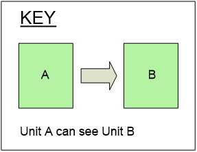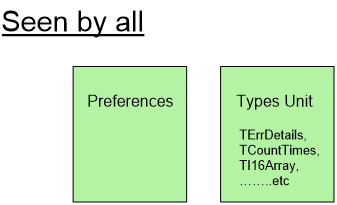
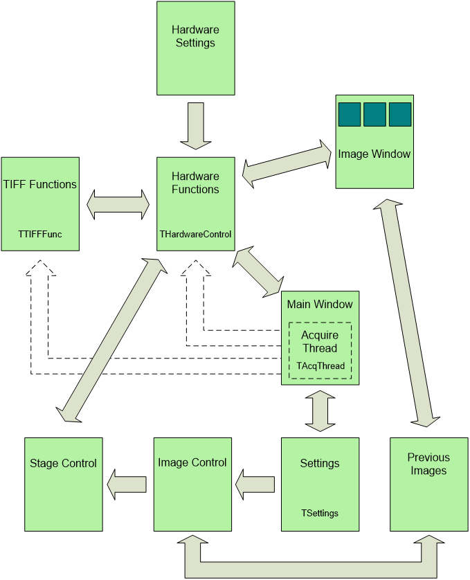

## 2. GUI Features

Multi-child window application with static header:

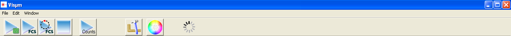

Raster image scanning parameters, and example live image:

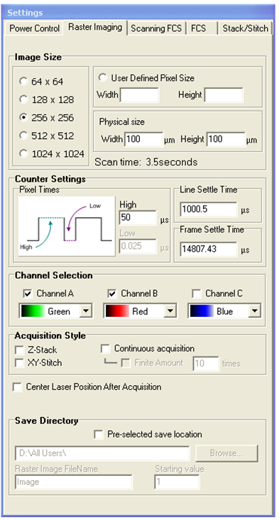 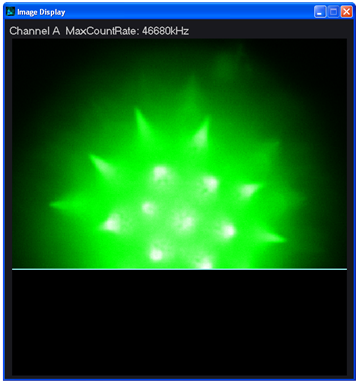

Other control options.  Laser power and Scanning FCS parameters:

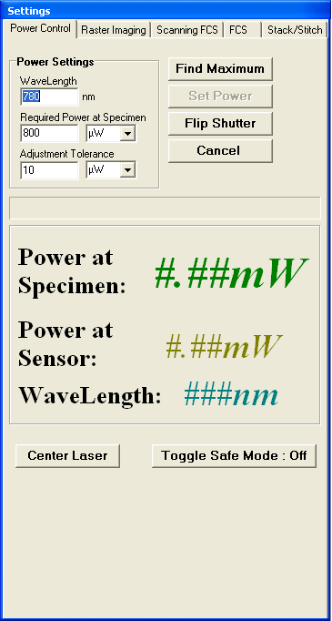   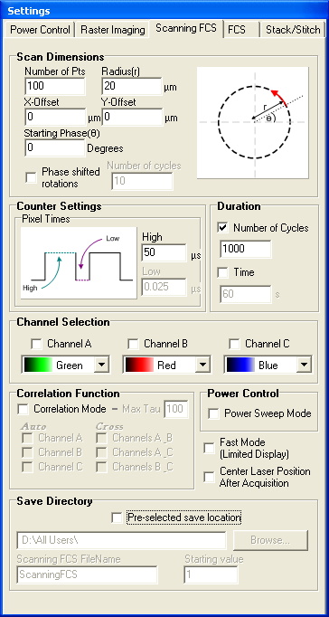

Z Stack and XY Stitch control and stage controller:

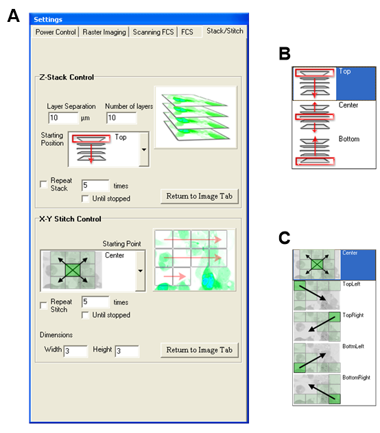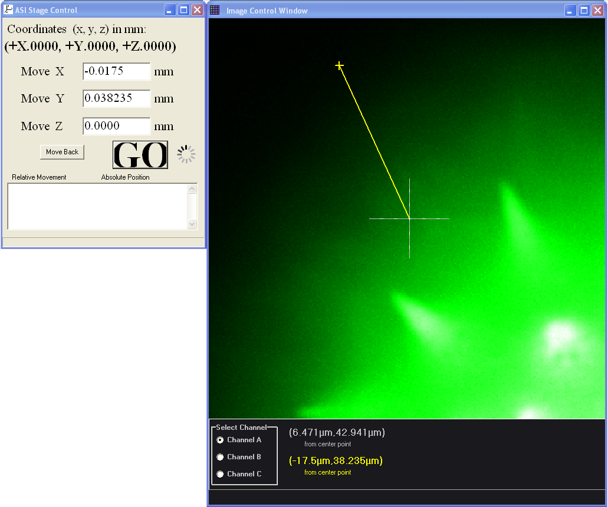

Non-Linear display toggle for bright and dim samples:

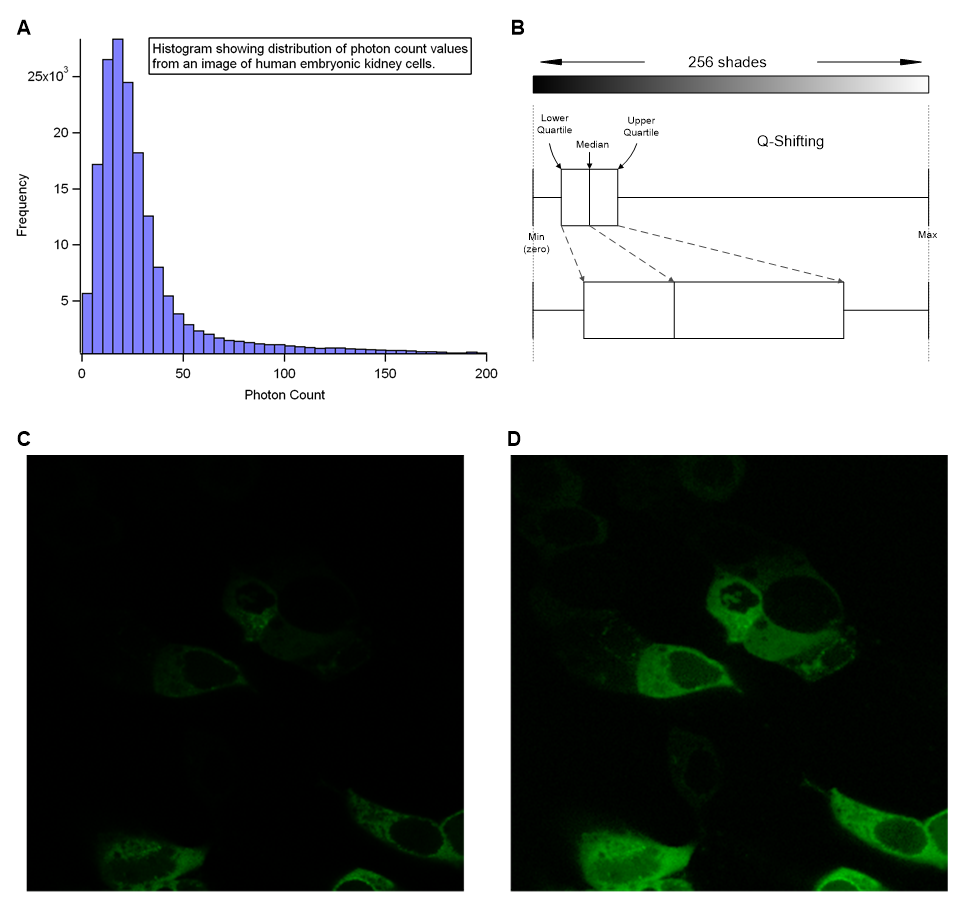

## 3. Custom Tif Files

Modified Tiff 6 standard to add metadata to additional custom tag:
